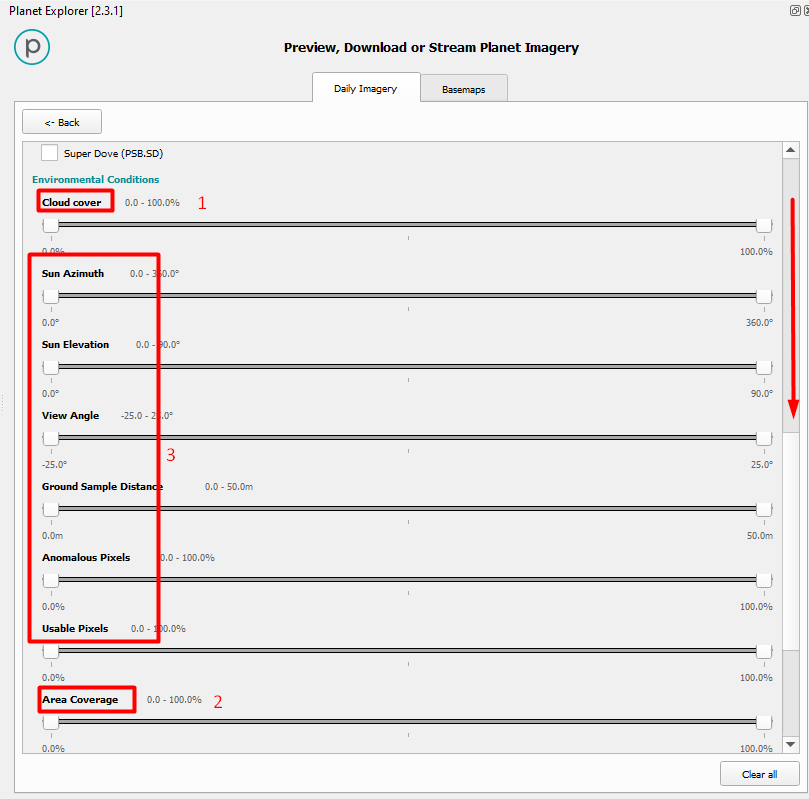
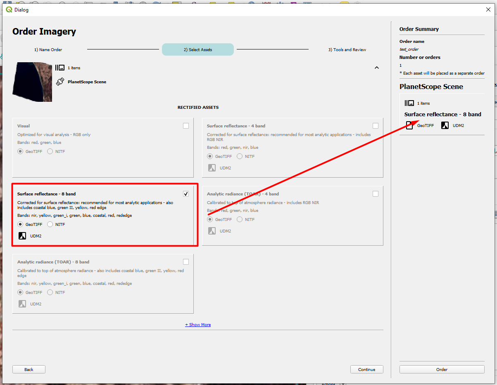

# Guide for Downloading PlanetScope Data in QGIS Software

## Sensor Characteristics and Academic Access Request

This project required access to high-resolution satellite imagery, for which PlanetScope was chosen among the available options. 

PlanetScope offers 8 spectral bands (see Table 1), a spatial resolution of 3 meters, and a temporal resolution that can reach daily intervals. Academic access is free but limited, and students or researchers can apply for access by following this [link](https://www.planet.com/industries/education-and-research/). It is important to review the access limitations specific to the user account.

| Band | Name        | Wavelength (fwhm) | Interoperable with Sentinel-2            |
|------|-------------|-------------------|------------------------------------------|
| 1    | Coastal Blue| 443 (20)          | Yes - with Sentinel-2 band 1             |
| 2    | Blue        | 490 (50)          | Yes - with Sentinel-2 band 2             |
| 3    | Green I     | 531 (36)          | No equivalent with Sentinel-2            |
| 4    | Green       | 565 (36)          | Yes - with Sentinel-2 band 3             |
| 5    | Yellow      | 610 (20)          | No equivalent with Sentinel-2            |
| 6    | Red         | 665 (31)          | Yes - with Sentinel-2 band 4             |
| 7    | Red Edge    | 705 (15)          | Yes - with Sentinel-2 band 5             |
| 8    | NIR         | 865 (40)          | Yes - with Sentinel-2 band 8a            |

**Table 1.** PlanetScope spectral bands. Source: Planet Labs, 2024.

## Downloading PlanetScope Satellite Images Using the QGIS Plugin

1. **Install the Plugin**: The first step is to install the 'Planet_Explorer' plugin by going to the QGIS plugins menu, as shown in Figure 1.

     
   **Figure 1.** Installing the Planet Explorer Plugin.

2. **Log In**: Access your PlanetScope account as shown in Figure 2.

     
   **Figure 2.** Accessing the PlanetScope account.

3. **Define Search Area**: After logging in, a window will appear allowing you to define your download area (Figure 3). Options include drawing or setting the area to the current view.

     
   **Figure 3.** Defining the search area.

4. **Access Search Filters**: Open the search filters as shown in Figure 4.

     
   **Figure 4.** Accessing search filters.

5. **Configure Filters**: In the filters window (Figure 5), you can set the search date range (1), select the satellite scenes (2)—including those from the older RapidEye constellation—and choose sensors outside of PlanetLabs such as Sentinel-2 or Landsat 8 (3). You can also specify the spectral bands for access (4).

     
   **Figure 5.** Configuring search filters including date range and spectral characteristics.

6. **Cloud Coverage and Area Filters**: Additional filters include cloud coverage (1) and the search area's coverage (2), as shown in Figure 6.

     
   **Figure 6.** Filtering by cloud coverage and search area extent.

7. **Search for Images**: Return to the main menu to search for available images using the applied filters (Figure 7). The search results can be previewed (2) to ensure clarity before selecting an image for download (3).

     
   **Figure 7.** Applying search filters and previewing results.

8. **Order Image Download**: To start downloading, select your desired image (Figure 8) (1) and click on 'Order' (2).

     
   **Figure 8.** Accessing the image order menu.

9. **Configure Image Order**: Name your order (1) and review the order summary in the right panel (2), as shown in Figure 9.

     
   **Figure 9.** Setting the order name and reviewing selections.

10. **Select Image Processing Options**: Choose the preprocessing type, such as TOA or BOA, and the spectral bands you wish to process (Figure 10).

      
    **Figure 10.** Configuring preprocessing and spectral bands.

11. **Customize the Order**: Use tools to crop the image to your search area (1), create compositions, harmonize images (3) for Sentinel-2 compatibility, and preview the final images (4), as shown in Figure 11.

      
    **Figure 11.** Using tools to customize image orders.

12. **Submit and Download**: Once verified, submit your order (6). You can then close the panel and access the download menu (1) to retrieve your images once ready (2), as shown in Figure 12.

      
    **Figure 12.** Accessing the download menu to retrieve images.

**Literature cited**
Planet Labs. (2024). Understanding PlanetScope Instruments. Planet Developers. https://developers.planet.com/docs/apis/data/sensors/

